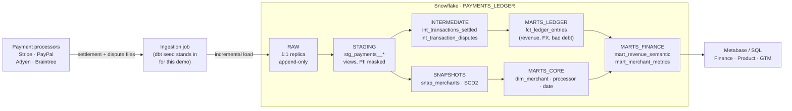
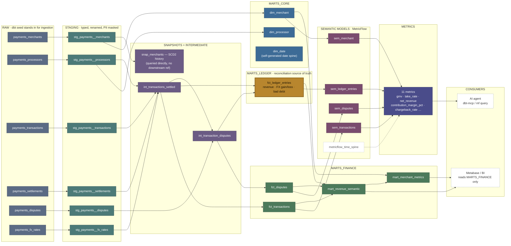

# Payments Settlement → Ledger → Financial Semantic Layer (dbt + Snowflake)

A production-shaped reference implementation of a payments analytics-engineering platform: ingest payment-processor **settlement and dispute data** into Snowflake, encode **accounting logic in code** (revenue recognition, bad-debt write-offs, FX gain/loss), and expose a **financial semantic layer** (GMV, take rate, contribution margin, chargeback rate, LTV/CAC) that Finance, Product, and GTM can all query and get the same number from.

This is a **portfolio/demo project**, built to prepare for an Analytics Engineer, Strategic Finance interview at a payments/marketplace company. It's not that company's code or data — it's a from-scratch, realistically-shaped implementation of the same problem (settlement ingestion → ledger → semantic layer → self-serve BI) so I can walk through real dbt models, real accounting logic, and real trade-offs rather than talk about them in the abstract.

---

## 1. The business problem

Every charge, refund, and chargeback a payment processor handles tells you something about the business — but a processor's raw settlement feed answers *"what did Stripe pay us"*, not *"what is our revenue, our take rate, or our bad-debt exposure this month."* Getting from one to the other means encoding real accounting policy: a lost chargeback on a transaction that was already paid out isn't a refund, it's bad debt; a GBP charge settled through a EUR-settling processor has FX gain/loss baked into it whether or not anyone modeled it; and "revenue" means something different to Finance (accrual, net of refunds and write-offs) than it does to a growth dashboard (gross, same-day).

This project builds that translation layer: ingest settlement/dispute data into Snowflake, recognize revenue and FX/bad-debt in dbt (not in a dashboard's SQL, not twice, not differently in two places), and land it in a tested, documented semantic layer any BI tool or analyst can query directly.

## 2. Architecture



**Layers**

| Layer | Contents | Purpose |
|---|---|---|
| `RAW` | 1:1 replica of processor exports | Append-only, never hand-edited |
| `staging` (`stg_payments__*`) | Typed, renamed, PII-masked views | One-to-one with source, no business logic |
| `snapshots` (`snap_merchants`) | SCD2 on merchant status | Historical correctness — join a past transaction to the merchant status *as of that date* |
| `intermediate` (`int_*`) | Transaction ↔ settlement ↔ FX rate joins | Isolates the join complexity from the accounting logic |
| `marts/ledger` (`fct_ledger_entries`) | Revenue recognition, FX gain/loss, bad-debt write-off — one row per transaction | The reconciliation source of truth |
| `marts/finance` | `mart_revenue_semantic`, `mart_merchant_metrics` | The semantic layer — what BI queries |



## 3. Accounting logic encoded in dbt

- **Revenue categorization** — [`macros/categorize_revenue.sql`](dbt_project/macros/categorize_revenue.sql): a captured charge is gross revenue, a refund reverses it, a lost dispute on an already-settled charge is bad debt (not a refund), an open dispute is held pending.
- **Bad-debt recognition** — [`macros/recognize_bad_debt.sql`](dbt_project/macros/recognize_bad_debt.sql): sweeps `bad_debt_writeoff` rows into a write-off amount, controlled by `var('bad_debt_recognition_lag_days')`.
- **FX gain/loss** — [`macros/fx_gain_loss.sql`](dbt_project/macros/fx_gain_loss.sql): the delta between a transaction's USD value at authorization and at settlement — real money movement for a GBP charge settled through a EUR-settling processor (Adyen in this dataset).
- **PII masking** — [`macros/mask_pii.sql`](dbt_project/macros/mask_pii.sql): merchant emails are masked at the staging boundary; access controls in [`snowflake/01_grants.sql`](snowflake/01_grants.sql) keep `BI_READER` off anything upstream of the semantic layer.

All of it lands in **`fct_ledger_entries`**, one row per transaction — so "why did reported revenue move" always has a single-table answer, and [`tests/assert_ledger_reconciles_to_settlements.sql`](dbt_project/tests/assert_ledger_reconciles_to_settlements.sql) guards that it stays tied to source.

Schema creation is also access-controlled: `DBT_TRANSFORMER` is deliberately **not** granted `CREATE SCHEMA` (see `snowflake/01_grants.sql`) — schemas are provisioned once, explicitly, via `snowflake/00_setup_database_warehouse.sql`, and [`macros/create_schema.sql`](dbt_project/macros/create_schema.sql) overrides dbt's default implicit `create schema if not exists` to a no-op so a model run can't silently create infrastructure it wasn't granted to create.

## 4. The financial semantic layer

`mart_revenue_semantic` (merchant × month): **GMV**, refunds, bad-debt write-offs, net revenue, processor cost (COGS), gross profit, **take rate**, **contribution margin**, **chargeback rate** — each defined exactly once. `mart_merchant_metrics` adds signup cohorts, retention, and an **LTV/CAC** ratio — deliberately built against a placeholder CAC var, documented as such, because real acquisition cost needs a marketing-spend source this demo doesn't have. That gap is itself the point: it's the difference between an accounting number and a product metric, called out explicitly instead of quietly faked.

## 5. Quickstart

```bash
cd dbt_project
cp profiles_example.yml ~/.dbt/profiles.yml   # fill in your Snowflake account details
dbt deps
dbt seed          # loads the simulated settlement/dispute data
dbt run --select staging
dbt snapshot
dbt run --exclude staging
dbt test
```

Provision the database/warehouses/roles first with [`snowflake/00_setup_database_warehouse.sql`](snowflake/00_setup_database_warehouse.sql) and [`snowflake/01_grants.sql`](snowflake/01_grants.sql).

## 6. What's in this repo

- **`dbt_project/`** — staging → intermediate → marts, seeds (simulated settlement data), macros (accounting logic + PII masking), a SCD2 snapshot, schema + singular tests, and a `semantic_models/` dbt Semantic Layer (MetricFlow) on top of the marts.
- **`snowflake/`** — database/warehouse/role provisioning and least-privilege grants.
- **`airflow/dags/payments_ledger_dag.py`** — daily orchestration: seed → staging → snapshot → marts → test. Deployed and running against a live Airflow 3.3.1 instance, not just written — see [`airflow/README.md`](airflow/README.md).
- **`.github/workflows/dbt_ci.yml`** — `sqlfluff` lint + `dbt build` on every PR touching `dbt_project/`.

## 7. Verified

This has been run end to end against a live Snowflake account: `dbt seed` → `dbt run --select staging` → `dbt snapshot` → `dbt run` → `dbt test` — **6 seeds, 16 models, 1 snapshot, 42 tests, 0 errors.** Sample output from `mart_revenue_semantic`, one merchant that had a chargeback lost after payout vs. one that didn't:

| merchant | gmv | net_revenue_usd | bad_debt_writeoff_usd | contribution_margin_pct |
|---|---|---|---|---|
| M006 (lost a $484.33 chargeback post-payout) | 1,497.00 | 1,012.67 | 484.33 | 95.65% |
| M002 (no disputes) | 897.00 | 897.00 | 0.00 | 97.00% |

## 8. Agent-readable semantic layer (dbt Semantic Layer / MetricFlow)

`mart_revenue_semantic` is a governed semantic layer, but it's still a *table* — querying "GMV" or "take rate" means knowing that table's SQL exists and how it's shaped. [`dbt_project/models/semantic_models/`](dbt_project/models/semantic_models/) defines the same metrics again, this time as dbt **`semantic_models` + `metrics`** config (`sem_transactions`, `sem_ledger_entries`, `sem_disputes`, `sem_merchant`, and `metrics.yml`) — built on top of the exact same marts, not a parallel definition — so they become queryable **by name**, with MetricFlow generating the SQL:

```bash
$ mf query --metrics gmv,net_revenue,take_rate,contribution_margin_pct,bad_debt_writeoff_usd \
    --group-by metric_time__month,merchant --order metric_time__month

MERCHANT      GMV    NET_REVENUE    TAKE_RATE    CONTRIBUTION_MARGIN_PCT    BAD_DEBT_WRITEOFF_USD
--------    -----    -----------    ---------    ------------------------    ----------------------
M006       1497.0        1012.67    0.0293988                    0.956541                    484.33
M002        897.0         897.0        0.03                       0.97                             0
```

Same M006 numbers as the table in §7 — reproduced from a completely independent query path (MetricFlow's own generated SQL, not `mart_revenue_semantic`'s), which is exactly the cross-check this was built to prove: **one metric, two ways of asking for it, one answer.**

This is the "agent-readable" half of a semantic layer: dbt Labs ships [`dbt-mcp`](https://github.com/dbt-labs/dbt-mcp), an MCP server that exposes `dbt sl list metrics` / `dbt sl query` as MCP tools — so an AI agent (Claude, in this session, or in production) can ask for `gmv` by name and get a governed number back, instead of writing SQL against the warehouse itself. Wiring that server up is a natural next step, not done in this repo (it's a runtime/session concern, not a repo one) — but every metric it would expose is already defined and validated here.

**Verified**: `mf validate-configs` passes with 0 errors (manifest, semantic models, dimensions, entities, measures, and all 11 metrics validated against the live warehouse). A real gotcha hit and fixed along the way: MetricFlow's `fill_nulls_with` didn't reach the generated SQL on the installed version (confirmed via `mf query --explain`) for metrics combining two semantic models — a merchant/month with zero refunds or zero disputes produced `NULL` instead of `0` and poisoned every derived metric downstream. Fixed by coalescing explicitly in each derived metric's `expr` (see the comments in `metrics.yml`) rather than trusting the declarative null-handling.

## 9. Known simplifications (said out loud, not hidden)

- Sample data is loaded via `dbt seed`, standing in for a real ingestion job landing rows in `RAW` — swap for `source()` against a live feed.
- FX rates are a sparse lookup table covering only the dates the sample data needs, not a full daily calendar.
- CAC in `mart_merchant_metrics` is a configurable placeholder, not attributed marketing spend.
- No live Metabase instance is deployed here; `MARTS_FINANCE` is modeled to be the schema a BI tool points at, and `BI_READER`'s grants in `01_grants.sql` reflect that boundary.

## 10. Metric lineage — `net_revenue`


## 11. Airflow DAG RUN 


