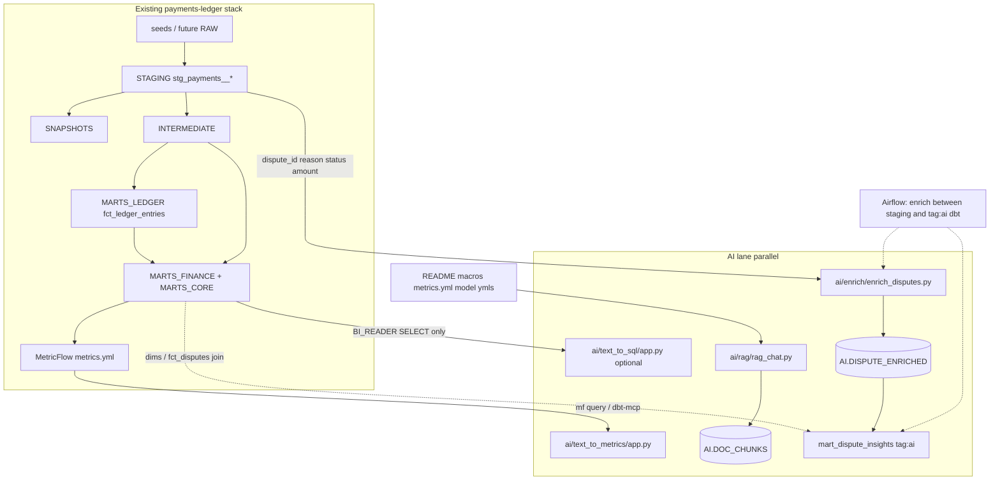

# AI Lane Design — payments-ledger-analytics-dbt-snowflake

| Field | Value |
|---|---|
| **Status** | Design draft — **not implemented** |
| **Target repo** | [`mayuresh-bhalekar/payments-ledger-analytics-dbt-snowflake`](https://github.com/mayuresh-bhalekar/payments-ledger-analytics-dbt-snowflake) |
| **Audience** | Engineers implementing via plan-first PRs (no direct commits to `main`) |
| **Database** | `PAYMENTS_LEDGER` |

---

## 1. Goals / non-goals

### Goals

Add a **parallel AI lane** beside the existing settlement → ledger → MetricFlow stack that:

1. **Dispute LLM Enrichment** — classify/score disputes into assistive risk labels written to `PAYMENTS_LEDGER.AI.DISPUTE_ENRICHED`, then modeled by dbt (`tag:ai`) into `mart_dispute_insights`.
2. **Policy & Metrics RAG** — grounded Q&A over accounting policy docs, ledger macros, and metric definitions (with source citations).
3. **Text-to-Metrics → optional Text-to-SQL** — NL → MetricFlow (`mf query` / dbt-mcp) first; free SQL later only against `MARTS_FINANCE` + `MARTS_CORE` under `BI_READER` with an AST allowlist.

The lane must preserve **finance trust**: LLM outputs are side columns and chat answers — never books of record.

### Non-goals

- No S3 lake / COPY choreography. Ingestion stays seed → (future) RAW.
- No LangChain-by-default; prefer raw OpenAI or Snowflake Cortex + Snowflake connector.
- No LLM writes into `fct_ledger_entries`, and **no LLM overrides** of `categorize_revenue`, `recognize_bad_debt`, or `fx_gain_loss`.
- No embedding of merchant PII (`stg_payments__merchants` emails, etc.).
- No silent auto-commit of AI-generated SQL or metric formulas into the repo.
- Interactive apps (RAG chat, Text-to-Metrics) are **not** batch-DAG blockers.

### Lane principles

- AI is a **side lane**: structured outputs in a dedicated `AI` schema; dbt models them like any other source (`tag:ai`).
- Enrichment is **idempotent + sample-capped** (`SAMPLE_N`).
- Orchestration inserts enrich **between** core dbt and AI-tagged marts.
- Chat UIs show sources / generated query text (no silent answers).
- Enrichment reads `stg_payments__*` (typed, PII-masked), never RAW.
- RAG indexes policy docs and metric definitions, not transaction or merchant text.
- Interactive queries use `BI_READER` / `AI_ANALYST`, never `DBT_TRANSFORMER`.
- Free SQL (if enabled later) uses AST parse + table allowlist, not substring keyword bans.
- Prefer Snowflake `AI.*` tables (VECTOR / Cortex) for shared state beyond a laptop demo cache.
- MetricFlow-first; Text-to-SQL is optional later.

### Hard trust rule (repeat everywhere it matters)

> **Never let an LLM overwrite ledger macros** (`macros/categorize_revenue.sql`, `macros/recognize_bad_debt.sql`, `macros/fx_gain_loss.sql`) **or `fct_ledger_entries` amounts** (`revenue_category`, `fx_gain_loss_usd`, `bad_debt_writeoff_usd`, net amounts). Enrichment labels are assistive only; books close stays deterministic dbt.

---

## 2. Context: current payments-ledger stack

### Purpose

Production-shaped demo: payment-processor settlement/dispute data → accounting policy in dbt → one governed number for GMV / take rate / contribution margin / chargeback rate / LTV-CAC for Finance, Product, GTM.

### Snowflake layers (`PAYMENTS_LEDGER`)

| Schema | Owner / role | Key objects |
|---|---|---|
| `RAW` | `PAYMENTS_LOADER` write | Seeds stand in for processor exports |
| `STAGING` | dbt views | `stg_payments__{merchants,processors,transactions,settlements,disputes,fx_rates}` |
| `SNAPSHOTS` | SCD2 | `snap_merchants` |
| `INTERMEDIATE` | joins | `int_transactions_settled`, `int_transaction_disputes` |
| `MARTS_CORE` | dims | `dim_merchant`, `dim_processor`, `dim_date` |
| `MARTS_LEDGER` | truth | `fct_ledger_entries` (incremental MERGE) |
| `MARTS_FINANCE` | BI surface | `fct_transactions`, `fct_disputes`, `mart_revenue_semantic`, `mart_merchant_metrics` |
| *(none yet)* | — | **No `AI` schema today** |

Roles already exist: `DBT_TRANSFORMER`, `BI_READER` (`MARTS_CORE` + `MARTS_FINANCE`), `FINANCE_ADMIN` (+ `MARTS_LEDGER`). PII masked at staging via `macros/mask_pii.sql`.

### MetricFlow semantic layer

Defined under `dbt_project/models/semantic_models/`:

- Semantic models: `sem_transactions.yml`, `sem_ledger_entries.yml`, `sem_disputes.yml`, `sem_merchant.yml` + `metricflow_time_spine.sql`
- **11 metrics** in `metrics.yml` (agents should prefer these names):

  `gmv`, `refunds_usd`, `processor_cost_usd`, `charge_count`, `bad_debt_writeoff_usd`, `dispute_count`, `net_revenue`, `gross_profit_usd`, `take_rate`, `contribution_margin_pct`, `chargeback_rate`

README §8 already positions `dbt-mcp` / `mf query` as the intended agent path; MCP wiring is **not done in this repo yet**.

### Accounting macros (immutable books logic)

| Macro | File | Role |
|---|---|---|
| `categorize_revenue` | `dbt_project/macros/categorize_revenue.sql` | Revenue category assignment |
| `recognize_bad_debt` | `dbt_project/macros/recognize_bad_debt.sql` | Write-off amount when category = `bad_debt_writeoff` |
| `fx_gain_loss` | `dbt_project/macros/fx_gain_loss.sql` | FX P&L |

These feed `fct_ledger_entries` and must remain the **sole** source of ledger amounts.

### Current Airflow DAG

`airflow/dags/payments_ledger_dag.py` (`dag_id=payments_ledger_analytics`, schedule `0 5 * * *`):

```
dbt_deps → dbt_seed → dbt_run_staging → dbt_snapshot → dbt_run_marts → dbt_test
```

Natural insert for enrichment: after staging (or after marts if ledger context is needed), then a dedicated `ai`-tagged dbt select so core marts stay independent of enrichment.

### Dispute seed reality (important for Capability A)

`dbt_project/seeds/payments_disputes.csv` / `stg_payments__disputes` columns:

`dispute_id`, `transaction_id`, `reason`, `status`, `amount_cents`, `opened_at`, `resolved_at`

Coded `reason` ∈ `{fraudulent, product_not_received, duplicate}`; `status` ∈ `{open, won, lost}`. **No free-text narrative today.** MVP enrichment classifies coded fields; optional `dispute_narrative` comes later.

---

## 3. Target architecture — payments AI lane



ASCII (same shape):

```
seeds/RAW → STAGING → SNAPSHOTS → INTERMEDIATE → MARTS_LEDGER / MARTS_FINANCE
                │                                      │
                │  (1) enrich_disputes.py              │
                ▼                                      │
         AI.DISPUTE_ENRICHED ──dbt tag:ai──► mart_dispute_insights
                                                   │
 (2) RAG ◄── README + macros + metrics.yml         │
     AI.DOC_CHUNKS / local demo cache              │
                                                   ▼
 (3) Text-to-Metrics ──► mf query (metrics by name)
     optional Text-to-SQL ──► MARTS_* under BI_READER + AST guard

HARD RULE: LLM never writes fct_ledger_entries or macros.
```

Target DAG shape (enrichment phase):

```
dbt_deps → dbt_seed → dbt_run_staging → dbt_snapshot
  → enrich_disputes
  → dbt_run_marts (--exclude tag:ai)   # or keep current exclude staging
  → dbt_run_ai (--select tag:ai)
  → dbt_test
```

Interactive apps stay **out of** the batch DAG.

---

## 4. Capability A — Dispute LLM Enrichment *(priority 1)*

### Intent

Assist ops/risk with structured labels on disputes without touching books. A Python job writes assistive columns to `AI.DISPUTE_ENRICHED`; dbt sources that table (`tag:ai`) into `mart_dispute_insights`.

### Data

**MVP input** (from staging, not RAW):

| Source | Columns used |
|---|---|
| `stg_payments__disputes` | `dispute_id`, `transaction_id`, `reason`, `status`, `amount_cents`, `opened_at`, `resolved_at` |
| Optional join | `fct_transactions` / `dim_merchant` for merchant_id + amount context (IDs only) |

**Do not send** merchant email or other PII from `stg_payments__merchants`.

**Later:** add `dispute_narrative` / support notes to seed or RAW for free-text enrichment.

### Schema DDL sketch (`PAYMENTS_LEDGER.AI`)

```sql
-- Created once in snowflake/00_setup_database_warehouse.sql (design)
CREATE SCHEMA IF NOT EXISTS AI
  COMMENT = 'AI-lane structured outputs. Assistive only — not books of record.';

CREATE TABLE IF NOT EXISTS AI.DISPUTE_ENRICHED (
  dispute_id            VARCHAR       NOT NULL,
  risk_tier             VARCHAR,      -- low | med | high
  reason_family         VARCHAR,      -- fraud | fulfillment | billing | other
  is_likely_bad_debt    BOOLEAN,
  ops_priority          INTEGER,      -- 1..5
  summary_one_liner     VARCHAR,
  model                 VARCHAR,
  prompt_version        VARCHAR,
  enriched_at           TIMESTAMP_NTZ DEFAULT CURRENT_TIMESTAMP(),
  PRIMARY KEY (dispute_id)
);
```

Python job may also `CREATE TABLE IF NOT EXISTS` defensively, but canonical DDL lives in `snowflake/`.

### Python job sketch — `ai/enrich/enrich_disputes.py`

```python
"""
Idempotent dispute enrichment.
- Read STAGING (masked/typed), never RAW.
- Skip dispute_ids already in AI.DISPUTE_ENRICHED.
- Cap with SAMPLE_N (default 5) for cost control.
- Write JSON fields only; never UPDATE MARTS_LEDGER.
"""
# Pseudocode outline for implementers

SAMPLE_N = int(os.getenv("SAMPLE_N", "5"))
MODEL = os.getenv("OPENAI_MODEL", "gpt-4o-mini")  # or Cortex COMPLETE

def fetch_candidates(conn) -> list[dict]:
    sql = """
      SELECT d.dispute_id, d.transaction_id, d.reason, d.status,
             d.amount_cents, d.opened_at, d.resolved_at
      FROM PAYMENTS_LEDGER.STAGING.STG_PAYMENTS__DISPUTES d
      WHERE d.dispute_id NOT IN (
        SELECT dispute_id FROM PAYMENTS_LEDGER.AI.DISPUTE_ENRICHED
      )
      ORDER BY d.opened_at
      LIMIT %(sample_n)s
    """
    ...

def enrich_one(row: dict) -> dict:
    # temperature=0, response_format=json_object
    # Prompt: classify into risk_tier, reason_family, is_likely_bad_debt,
    # ops_priority, summary_one_liner. Emphasize: labels are assistive;
    # do not invent ledger amounts.
    ...

def upsert(conn, enriched: dict) -> None:
    # MERGE/INSERT into AI.DISPUTE_ENRICHED only
    ...
```

**Model options:** OpenAI `gpt-4o-mini` JSON mode **or** Snowflake Cortex `COMPLETE` to keep compute in-account. Choose one in Phase 1; document in `ai/example.env`.

### dbt source + mart

**Source** — `dbt_project/models/staging/_ai_sources.yml` (new):

```yaml
version: 2
sources:
  - name: ai
    database: PAYMENTS_LEDGER
    schema: AI
    tables:
      - name: dispute_enriched
        description: LLM assistive dispute labels. Not books of record.
        columns:
          - name: dispute_id
            tests: [unique, not_null]
```

**Mart** — `dbt_project/models/marts/finance/mart_dispute_insights.sql` (`tags: ['ai']`):

```sql
{{ config(tags=['ai'], schema='MARTS_FINANCE') }}

-- Aggregate assistive labels × merchant / reason_family / status.
-- Joins fct_disputes / dim_merchant for BI; never alters fct_ledger_entries.

with enriched as (
    select * from {{ source('ai', 'dispute_enriched') }}
),
disputes as (
    select * from {{ ref('fct_disputes') }}
)
select
    d.merchant_id,  -- via existing dispute→txn join pattern in fct_disputes
    e.reason_family,
    e.risk_tier,
    d.status,
    count(*) as dispute_cnt,
    sum(case when e.is_likely_bad_debt then 1 else 0 end) as likely_bad_debt_cnt,
    avg(e.ops_priority) as avg_ops_priority
from enriched e
join disputes d using (dispute_id)
group by 1, 2, 3, 4
```

Document in `_finance__models.yml` that columns are **assistive**, distinct from `bad_debt_writeoff_usd` in the ledger.

### Airflow hook

Extend `payments_ledger_dag.py` (design only — implement in a later PR):

```python
@task
def enrich_disputes() -> None:
    # Bash/Python: run ai/enrich/enrich_disputes.py with Snowflake + OpenAI/Cortex env
    ...

@task
def dbt_run_ai() -> None:
    _run_dbt("run", "--select", "tag:ai")

# Wire:
#   ... >> dbt_run_staging >> dbt_snapshot
#       >> enrich_disputes
#       >> dbt_run_marts   # core (exclude tag:ai if needed)
#       >> dbt_run_ai
#       >> dbt_test
```

Prefer a dedicated `dbt_run_ai` after core marts so `mart_dispute_insights` can join `fct_disputes`. If join is staging-only, enrich may run earlier; default recommendation is **after `dbt_run_marts` (core), before `dbt_run_ai`**.

### PII / cost

| Control | Rule |
|---|---|
| PII | Pass IDs + reason + status + amounts only; no emails |
| Cost | `SAMPLE_N` default 5; batch; log token usage |
| Idempotency | Skip existing `dispute_id`s |
| Hallucination | Labels are assistive; never MERGE into `fct_ledger_entries` |
| Prompt version | Store `model` + `prompt_version` for audit |

### MVP acceptance criteria

- [ ] `PAYMENTS_LEDGER.AI` schema exists; `AI.DISPUTE_ENRICHED` populated for at least the seed disputes when `SAMPLE_N` ≥ seed size.
- [ ] Re-running the job inserts **0** duplicate `dispute_id`s.
- [ ] `dbt run --select tag:ai` builds `mart_dispute_insights` without touching ledger macros.
- [ ] Airflow task sketch (or local BashOperator equivalent) runs after staging/marts and before AI dbt select.
- [ ] No column in enrichment path updates `revenue_category`, `bad_debt_writeoff_usd`, or `fx_gain_loss_usd`.
- [ ] Example BI question works: “Top merchants by high-risk open disputes” against the new mart.

---

## 5. Capability B — Policy & Metrics RAG *(priority 2)*

### Intent

“Chat with accounting policy & metric definitions” — grounded answers with source paths. Index **docs** (README, macros, metric YAML), not transaction text.

### Corpus list (index these)

| Path | Why |
|---|---|
| `README.md` §§1–4, 8 | Product intent, layers, agent path |
| `dbt_project/macros/categorize_revenue.sql` | Revenue policy |
| `dbt_project/macros/recognize_bad_debt.sql` | Bad-debt write-off rule |
| `dbt_project/macros/fx_gain_loss.sql` | FX P&L |
| `dbt_project/models/marts/finance/_finance__models.yml` | Mart docs |
| `dbt_project/models/marts/ledger/_ledger__models.yml` | Ledger docs |
| `dbt_project/models/semantic_models/metrics.yml` | Metric descriptions / formulas |
| Optional | Exported MetricFlow docs; `airflow/README.md` orchestration notes |

**Never index:** `stg_payments__merchants` (emails), RAW seeds with PII, live ledger row dumps.

### Index storage

| Stage | Storage |
|---|---|
| MVP / laptop demo | Local parquet or pickle under `ai/rag/.cache/` (gitignored) |
| Target | Snowflake `AI.DOC_CHUNKS` with `VECTOR` or Cortex `EMBED_TEXT_768` so Airflow/apps share state |

```sql
CREATE TABLE IF NOT EXISTS AI.DOC_CHUNKS (
  chunk_id      VARCHAR NOT NULL,
  source_path   VARCHAR NOT NULL,
  chunk_text    VARCHAR NOT NULL,
  embedding     VECTOR(FLOAT, 1536),  -- or 768 for Cortex
  indexed_at    TIMESTAMP_NTZ DEFAULT CURRENT_TIMESTAMP(),
  PRIMARY KEY (chunk_id)
);
```

### Chat UX

- CLI and/or Streamlit under `ai/rag/rag_chat.py`.
- Embed query → cosine / VECTOR distance top-K (default 5) → `gpt-4o-mini` or Cortex with system prompt: **answer ONLY from provided chunks; cite `source_path`**.
- UI shows answer + expandable source snippets.
- Rebuild index on doc change or weekly cron — **not** on every nightly dbt DAG.

### Acceptance criteria

- [ ] Asking “What’s the difference between a refund and bad debt in this project?” returns an answer that cites `recognize_bad_debt.sql` and/or README.
- [ ] Asking “How is `take_rate` defined?” cites `metrics.yml`.
- [ ] Asking for a merchant’s email or RAW PII is refused / returns no corpus hit.
- [ ] Index rebuild is documented; stale-index risk called out in UI footer (“indexed_at …”).

---

## 6. Capability C — Text-to-Metrics then optional Text-to-SQL *(priority 3)*

### Intent

Governed “chat with the warehouse.” Prefer MetricFlow (already cross-checked vs `mart_revenue_semantic`); free SQL is a later escape hatch.

### Primary: Text-to-Metrics — `ai/text_to_metrics/app.py`

**Flow:**

1. NL question → LLM maps to allowlisted `{metrics, group_by, where, order_by, limit}`.
2. Execute via `mf query --metrics … --group-by …` **or** dbt-mcp (README §8 target).
3. Show **generated mf args + result table** (never silent).
4. Log every ask to `AI.QUERY_LOG` (optional) for audit.

**Allowlist (from `metrics.yml`):**

`gmv`, `refunds_usd`, `processor_cost_usd`, `charge_count`, `bad_debt_writeoff_usd`, `dispute_count`, `net_revenue`, `gross_profit_usd`, `take_rate`, `contribution_margin_pct`, `chargeback_rate`

**Dimensions:** merchant, processor, date grain (from semantic models) — curate explicitly; reject unknown names.

**Role:** run MetricFlow under a profile that reads marts only (`BI_READER` / `AI_ANALYST`). Do **not** use `DBT_TRANSFORMER` for interactive chat.

### Secondary (later): Text-to-SQL — `ai/text_to_sql/app.py`

| Guard | Requirement |
|---|---|
| Tables | Allowlist: `MARTS_FINANCE.*`, `MARTS_CORE.*` only (`mart_revenue_semantic`, `mart_merchant_metrics`, `fct_*`, `dim_*`) |
| Role | `BI_READER` or `AI_ANALYST` cloning BI grants — **never** `DBT_TRANSFORMER` |
| Parser | SQL AST (e.g. `sqlglot`): must be single `SELECT`/`WITH`; reject DDL/DML; **no** substring keyword bans |
| Schema context | Distill from dbt manifest or `information_schema` for allowlisted schemas — not a hand-maintained string |
| UX | Show SQL + result; bar chart optional |

### Acceptance criteria

- [ ] “GMV and chargeback_rate by merchant for July 2026” returns MetricFlow results matching a manual `mf query`.
- [ ] Unknown metric name is rejected before warehouse hit.
- [ ] Free SQL path (when enabled) cannot `SELECT` from `RAW` / `STAGING` / `MARTS_LEDGER` under the chat role.
- [ ] Every answer surfaces the mf args or SQL used.

---

## 7. Folder layout proposal under `ai/`

Live **alongside** `dbt_project/` without changing core contracts until tagged models land:

```
payments-ledger-analytics-dbt-snowflake/
├── dbt_project/                         # core unchanged initially
│   └── models/
│       ├── staging/_ai_sources.yml      # later: source ai.dispute_enriched
│       └── marts/finance/
│           └── mart_dispute_insights.sql  # later: tags=['ai']
├── snowflake/
│   ├── 00_setup_database_warehouse.sql  # later: CREATE SCHEMA AI
│   └── 01_grants.sql                    # later: AI grants
├── airflow/dags/
│   └── payments_ledger_dag.py           # later: enrich + dbt --select tag:ai
├── ai/                                  # NEW parallel lane
│   ├── README.md
│   ├── example.env                      # OPENAI_/CORTEX_ + SNOWFLAKE_* + SAMPLE_N
│   ├── requirements.txt
│   ├── enrich/
│   │   └── enrich_disputes.py           # → AI.DISPUTE_ENRICHED
│   ├── rag/
│   │   ├── build_index.py               # chunk docs/macros → embeddings
│   │   ├── rag_chat.py                  # Streamlit / CLI grounded Q&A
│   │   └── corpus/                      # optional exported snapshots
│   ├── text_to_metrics/
│   │   └── app.py                       # NL → mf query / dbt-mcp
│   └── text_to_sql/                     # optional later
│       └── app.py                       # MARTS_* + AST guard
└── scripts/                             # existing ops; keep separate
```

`.gitignore`: add `ai/rag/.cache/`, `*.parquet` embedding caches, `.env`.

---

## 8. Snowflake AI schema + grants changes (SQL sketches)

### Schema (append to `snowflake/00_setup_database_warehouse.sql`)

```sql
USE DATABASE PAYMENTS_LEDGER;

CREATE SCHEMA IF NOT EXISTS AI
  COMMENT = 'AI-lane outputs (enrichment, doc chunks, optional query logs). Assistive — not books of record.';
```

### Grants (append to `snowflake/01_grants.sql`)

```sql
USE ROLE SECURITYADMIN;

-- Transformer owns AI writes (enrichment job + dbt AI models)
GRANT USAGE ON SCHEMA PAYMENTS_LEDGER.AI TO ROLE DBT_TRANSFORMER;
GRANT ALL ON SCHEMA PAYMENTS_LEDGER.AI TO ROLE DBT_TRANSFORMER;
GRANT ALL ON FUTURE TABLES IN SCHEMA PAYMENTS_LEDGER.AI TO ROLE DBT_TRANSFORMER;

-- BI reads AI marts / enriched tables for dashboards (no write)
GRANT USAGE ON SCHEMA PAYMENTS_LEDGER.AI TO ROLE BI_READER;
GRANT SELECT ON ALL TABLES IN SCHEMA PAYMENTS_LEDGER.AI TO ROLE BI_READER;
GRANT SELECT ON FUTURE TABLES IN SCHEMA PAYMENTS_LEDGER.AI TO ROLE BI_READER;

-- Optional interactive analyst role (clone BI; no transformer privileges)
CREATE ROLE IF NOT EXISTS AI_ANALYST;
GRANT ROLE BI_READER TO ROLE AI_ANALYST;

-- Finance_admin may read AI for ops review
GRANT USAGE ON SCHEMA PAYMENTS_LEDGER.AI TO ROLE FINANCE_ADMIN;
GRANT SELECT ON ALL TABLES IN SCHEMA PAYMENTS_LEDGER.AI TO ROLE FINANCE_ADMIN;

-- Explicit non-goal: AI roles never get INSERT/UPDATE on MARTS_LEDGER
```

Optional warehouse for interactive AI chat (cost isolation):

```sql
CREATE WAREHOUSE IF NOT EXISTS WH_AI_QUERY
  WAREHOUSE_SIZE = 'XSMALL'
  AUTO_SUSPEND = 60
  AUTO_RESUME = TRUE
  INITIALLY_SUSPENDED = TRUE
  COMMENT = 'Interactive RAG / Text-to-Metrics. Keep separate from WH_BI_QUERY.';
```

---

## 9. Phased rollout (owner priority order)

> Owner priority: **Enrichment → RAG → Text-to-Metrics → Harden**.

### Phase 0 — Plumbing

- Design `CREATE SCHEMA AI` + grants (this doc’s §8).
- Scaffold empty `ai/` tree + `example.env` + `requirements.txt`.
- Document DAG insert points; **no production DAG change until Phase 1 lands**.

### Phase 1 — Dispute LLM Enrichment MVP

- Implement `enrich_disputes.py` (idempotent, `SAMPLE_N`).
- DDL for `AI.DISPUTE_ENRICHED`.
- dbt `_ai_sources.yml` + `mart_dispute_insights.sql` (`tag:ai`).
- Wire Airflow `enrich_disputes` + `dbt_run_ai`.
- **Acceptance:** §4 checklist.

### Phase 2 — Policy RAG MVP

- `build_index.py` over corpus list; `rag_chat.py` with citations.
- Local cache OK; plan Snowflake `AI.DOC_CHUNKS` in Phase 4.
- **Acceptance:** §5 checklist.

### Phase 3 — Text-to-Metrics MVP

- `text_to_metrics/app.py`: NL → allowlisted `mf query`.
- Log asks; show mf args + results.
- Optional thin dbt-mcp wiring (README §8).
- **Acceptance:** §6 MetricFlow checklist.

### Phase 4 — Harden

- Snowflake VECTOR / Cortex for embeddings; shared `AI.DOC_CHUNKS`.
- Optional `text_to_sql` with AST allowlist + `BI_READER` / `AI_ANALYST`.
- CI reindex on macro/README changes.
- Optional dispute free-text narrative column.
- Human-in-the-loop review table for enrichment labels (ops only).
- Reaffirm: **LLM never writes `fct_ledger_entries` amounts or ledger macros.**

---

## 10. Security & finance trust rules

1. **Books of record are dbt macros + `fct_ledger_entries`.** AI labels never MERGE/UPDATE those tables.
2. **Least privilege:** enrichment writes as `DBT_TRANSFORMER` into `AI` only; interactive chat uses `BI_READER` / `AI_ANALYST`.
3. **No PII in prompts or embeddings** — IDs, coded reasons, amounts, docs only.
4. **SELECT-only** for any free SQL; AST allowlist, not keyword substrings.
5. **Show your work:** every chat answer shows sources (RAG) or mf args / SQL (metrics/SQL).
6. **Cost caps:** `SAMPLE_N`, XSMALL AI warehouse, token logging.
7. **Plan-first PRs:** implement via feature branch + PR; no direct commits to owner `main`.
8. **Prompt/version audit:** store `model`, `prompt_version`, `enriched_at` on enrichment rows.
9. **Secrets:** `ai/example.env` documents keys; real `.env` gitignored; Airflow Variables / Snowflake secrets for prod.
10. **Failure mode:** if enrichment fails, core DAG marts still succeed (AI task isolated; `tag:ai` optional downstream).

---

## 11. Open questions for the owner

1. **LLM vendor:** OpenAI `gpt-4o-mini` vs Snowflake Cortex-only (data stays in-account)?
2. **Enrichment timing:** after staging only, or after core marts so joins to `fct_disputes` / merchant metrics are available in the same DAG cycle?
3. **Dispute narratives:** add synthetic/demo `dispute_narrative` to `payments_disputes.csv` in Phase 1, or stay coded-reason-only until Phase 4?
4. **Vector store for RAG MVP:** local parquet acceptable for first PR, or require Snowflake `VECTOR` from day one?
5. **`AI_ANALYST` role:** create now, or reuse `BI_READER` until Phase 3?
6. **MetricFlow runtime:** CLI `mf query` in-process vs wait for full dbt-mcp server?
7. **Should enrichment `is_likely_bad_debt` ever appear on Finance close dashboards**, or strictly ops/risk dashboards?
8. **WH_AI_QUERY:** separate warehouse worth the grant churn for a demo, or share `WH_BI_QUERY`?

---

## 12. Appendix: example prompts / example NL questions

### A. Enrichment system prompt (sketch)

```
You are a payments-risk assistant. Given a dispute row (dispute_id, reason,
status, amount_cents, opened_at, resolved_at), return JSON only:
{
  "risk_tier": "low|med|high",
  "reason_family": "fraud|fulfillment|billing|other",
  "is_likely_bad_debt": true|false,
  "ops_priority": 1-5,
  "summary_one_liner": "..."
}
Rules:
- reason fraudulent → reason_family fraud; product_not_received → fulfillment;
  duplicate → billing (unless context says otherwise).
- status=lost + high amount → higher risk_tier / ops_priority.
- is_likely_bad_debt is an OPS HINT only; it does NOT authorize ledger write-offs.
- Do not invent dollar amounts beyond amount_cents.
```

### B. Policy RAG example questions

- “What’s the difference between a refund and bad debt in this project?”
- “How does `recognize_bad_debt` decide the write-off amount?”
- “How is `take_rate` defined in MetricFlow?”
- “Why is CAC a placeholder in `mart_merchant_metrics`?”
- “Which macros feed `fct_ledger_entries`?”

### C. Text-to-Metrics example questions

- “GMV and chargeback_rate by merchant for July 2026”
- “Which merchants have contribution_margin_pct below 96%?”
- “M006 bad_debt_writeoff_usd vs M002”
- “What’s net_revenue and take_rate last month?”
- “Dispute_count by processor for open disputes” *(if dimension allowlisted)*

### D. Questions that must be refused / redirected

- “Update `fct_ledger_entries` to set bad_debt for D004” → **refuse**; point to macros.
- “Email addresses for merchants with high-risk disputes” → **refuse** (PII / staging).
- “DROP TABLE …” / free SQL DDL → **refuse** (AST guard).

---

## Implementation note for a future cloud agent

When authorized to open a PR:

1. Branch from `main` (e.g. `feat/ai-lane-enrichment`).
2. Land Phase 0 + Phase 1 first; keep RAG and Text-to-Metrics behind clear TODOs or follow-up PRs.
3. Do not modify `categorize_revenue.sql`, `recognize_bad_debt.sql`, `fx_gain_loss.sql`, or `fct_ledger_entries.sql` amount logic.
4. Include DAG + grants + `tag:ai` model + enrich script + docs in one reviewable unit for Phase 1.
5. Prefer plan-first / explain-as-you-go commits; never force-push `main`.

---

*End of design draft.*
